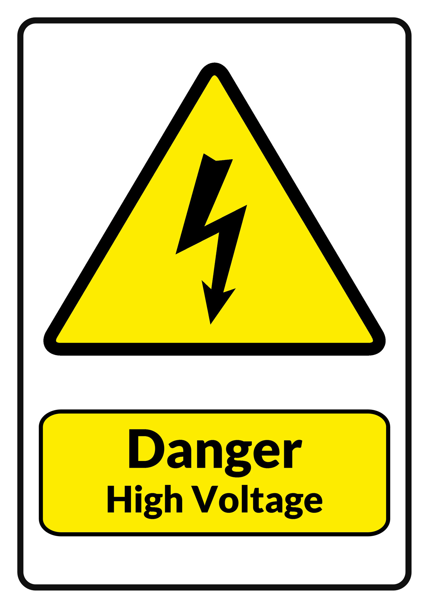

# ESP32 based multichannel clamp energy meter

Device that allows installation of multiple clamp / split current transformer energy meters (one per circuit breaker in home distribution box, so effectively per-room monitoring) and readout transmission over home automation protocols over IP. 

## This project is related to mains, which is DEADLY. Proceed at your own risk. No responsibility taken by authors.

