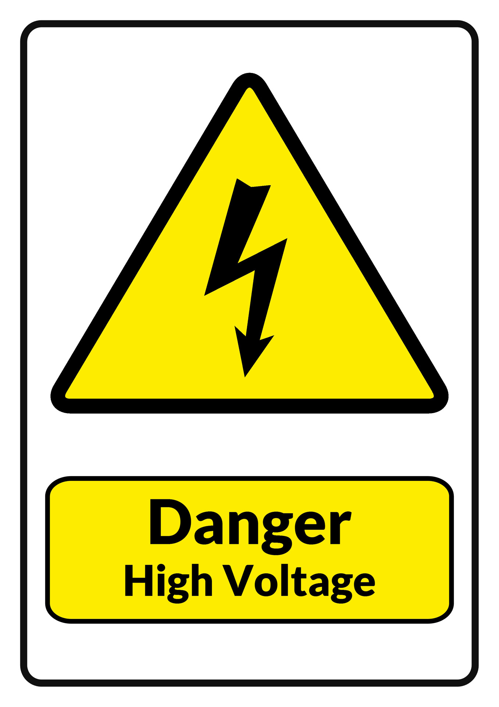

# Hardware

## This project is related to mains, which is DEADLY. Proceed at your own risk. No responsibility taken by authors.

## USB isolator for programming

Even though PZEMs have built-in optocouplers I prefer to connect ESP32 that is connected to a device that is connected to mains via USB isolator / optocoupler pass-through to my computer. 

## Bill of Materials

- MCU: ESP32 Dev Board - see [MCU.md](MCU.md)
- energy meter modules (depending on circuit breakers count) - `PZEM-004T-100A` - with plastic case and external split current transformer 
- cables and connectors: TBD
- plastic case - Kradex Z34B

## Schematic

Fritzing project: TBD

<!--  -->

## Modbus RTU

Each energy meter module comes set with address set to `0xF8`. Separate programming routine is required, that sets address to desired value, which has to be done with only one module connected to Modbus RTU, preferably using separate Arduino device. Arduino sketch for that - TBD.
